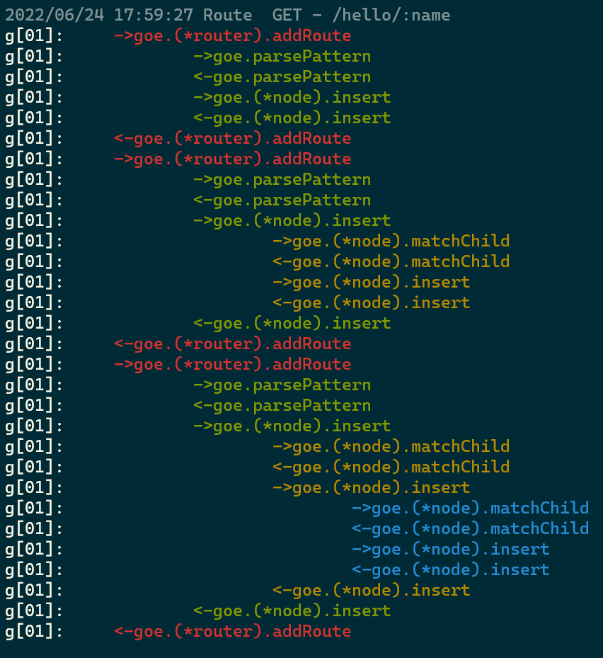
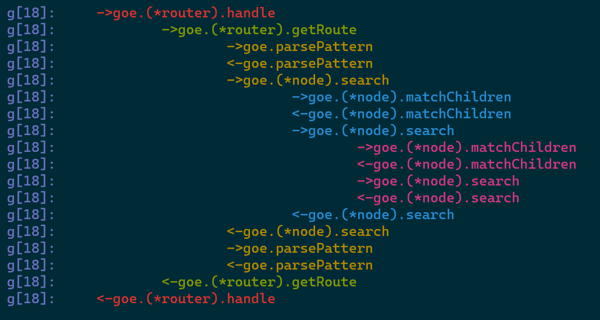

:(fab fa-github): [Github项目地址](https://github.com/EnhaoSun/funchain)
## 介绍
-------
> **funchain**是用go编写的，可以用来追踪函数调用链的一个工具。

因为最近在学习go， 跟着[七天用Go从零实现系列](https://geektutu.com/post/gee.html)教程走了一遍。但是对于我这种菜鸟，函数一多，脑子就比较乱，糊里糊涂不知道一个RESFTUL请求过来，都是调用了哪些函数，顺序是怎么样的。

因此，想着能否通过go语言本身，把一个请求的调用链给打印出来。

于是上网搜了搜，找到了一个工具：[https://github.com/bigwhite/functrace](https://github.com/bigwhite/functrace)

不过这个工具还是有一些不足的地方：
* 并发情况下，多个线程打印是穿插着进行的，看着很乱
* 色彩单一，没法一目了然。

因此我基于这个工具做了一点点改动：
* 多线程情况下，同一个线程内的函数调用，一起打印
* 添加了多色彩的支持

## 如何使用
> 这个工具原理很简单，就是利用了go的defer语法糖，在函数入口和出口打印函数名。

只需要在go.mod里添加如下依赖
```shell
require github.com/EnhaoSun/funchain v1.0.0 // indirect
```

添加完依赖以后，在你想要追踪的函数里，添加defer，如下：
```go
import "github.com/EnhaoSun/funchain"

func () xxx() {
    defer funchain.Trace()()
    //....
}
```

## 多色彩的console输出
例如，我在[Go语言动手写Web框架第三天](https://geektutu.com/post/gee-day3.html)的如下函数里添加了defer：
```go
// router.go
func parsePattern(pattern string) []string
func (r *router) getRoute(method string, path string) (*node, map[string]string)
func (r *router) addRoute(method string, pattern string, handler HandleFunc)
func (r *router) handle(c *Context)

// trie.go
func (n *node) insert(pattern string, parts []string, height int)
func (n *node) matchChild(part string) *node
func (n *node) matchChildren(part string) []*node
func (n *node) search(parts []string, height int) *node

```
然后，添加路由
```go
	r.GET("/", func(ctx *goe.Context) {
		ctx.HTML(http.StatusOK, "<h1>Hello Goe</h1>")
	})
	// ...后续还有添加几个
```
------
其函数调用链的打印结果如下：




------
添加完路由以后，发送一个GET请求，其函数调用链的打印结果如下：



## 总结
这个小工具涉及到的go语言知识:
* `defer`的使用
* `sync.Mutex`同步锁
* `runtime`包获取program counter，函数名

## Reference
* [https://github.com/bigwhite/functrace](https://github.com/bigwhite/functrace)
